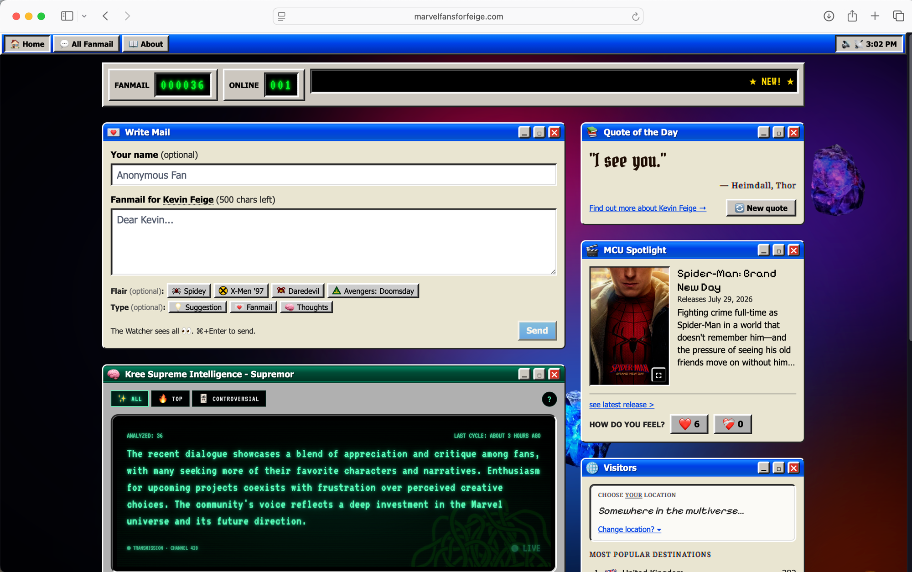

# marvelfansforfeige.com

A fan-letter guestbook for **Kevin Feige**, built after _Thunderbolts\*_ by a Malaysian Marvel fan. Visitors leave short messages, upvote/downvote each other's takes, and a "hot" algorithm surfaces the best ones — all wrapped in a heavy retro / 2000s aesthetic: Windows XP/Vista UI chrome (titlebars, bevels, taskbar) over an iTunes-visualizer dark backdrop with Infinity-Stone blob glows drifting behind everything.

🌐 **Live:** [marvelfansforfeige.com](https://marvelfansforfeige.com)



## Features

- **📨 Write Mail** — leave a short fan letter for Kevin Feige (optional name, 500 chars). Tag it with a **flair** (the MCU project it's about) and a **type** (Suggestion / Fanmail / Thoughts). Messages pass through OpenAI moderation before joining a soft approval queue.
- **🔥 Hot ranking & voting** — upvote/downvote any take; a weighted "hot" algorithm plus new/top/controversial sorts surface the community's best.
- **🧠 Kree Supreme Intelligence** — a Captain-Marvel-style CRT hologram that runs a daily LLM digest of approved comments across TOP TAKES / DISSENT / THE COLLECTIVE.
- **🎬 MCU Spotlight** — the next upcoming MCU release pulled live from TMDB, with a ❤️ / 💔 sentiment voter.
- **💎 "Fated to one stone"** — every visitor is permanently assigned one of the six Infinity Stones as their identity, with a daily 10% chance it appears as a rare composer flair. A first-visit modal reveals your stone.
- **💬 Quote of the Day** — a deterministic daily rotation of real Kevin Feige quotes, refreshable once per visitor per day.
- **🌍 Visitors** — live online-now presence counter, a global hit counter, and a most-popular-locations board.
- **🔊 Tactile XP UX** — Web Audio click sounds (velocity-aware), functional window minimize/maximize, scrolling marquees, and animated stone glows for that mmm.page feel.

## Stack

- **[SvelteKit 2](https://svelte.dev/docs/kit)** with **Svelte 5** runes (`$state`, `$props`, `$derived`, snippets)
- **[Tailwind CSS v4](https://tailwindcss.com)** via `@tailwindcss/vite` — all XP/Vista chrome is bespoke CSS (no UI component library)
- **[Cloudflare Pages](https://pages.cloudflare.com)** via `@sveltejs/adapter-cloudflare` (server routes run on Workers)
- **[Supabase](https://supabase.com)** — Postgres + RLS, accessed server-side with the service role
- **[OpenAI](https://platform.openai.com)** — comment moderation + daily Supreme Intelligence summaries (`gpt-4o-mini`)
- **[TMDB](https://www.themoviedb.org)** — MCU Spotlight data
- **[PostHog](https://posthog.com)** — analytics
- **[GSAP](https://gsap.com)** — backdrop blob animation (dynamic-imported so it never SSR-evaluates)

## Getting started

```bash
pnpm install
pnpm dev          # local dev server on :5173
```

Other commands:

```bash
pnpm build        # production build (Cloudflare adapter output)
pnpm preview      # serve the built output locally
pnpm check        # svelte-check (types)
pnpm lint         # prettier + eslint
pnpm format       # prettier write
```

## Environment

| Variable          | Purpose                                                                                                                        |
| ----------------- | ------------------------------------------------------------------------------------------------------------------------------ |
| `VOTER_HASH_SALT` | Secret salt for `voterHash(ip, ua)`. **Permanent** — rotating it resets every visitor's identity (votes, stones, rate limits). |
| `CRON_SECRET`     | Bearer token gating `/api/cron/refresh-summaries`. Generate with `openssl rand -hex 32`.                                       |

Supabase, OpenAI, TMDB, and PostHog credentials are also required — see `src/lib/server/` for usage.

## Database

Postgres on Supabase. Migrations live in `supabase/migrations/` as numbered SQL files and are **applied manually via the Supabase Web SQL Editor** (the numbering is for ordering/history only — the dashboard doesn't track applied state).

## Daily summary cron

The Supreme Intelligence digest refreshes via a daily external POST to `/api/cron/refresh-summaries`, gated by the `CRON_SECRET` bearer token. Use a Cloudflare Worker cron trigger or any external scheduler:

```bash
curl -X POST -H "authorization: Bearer $CRON_SECRET" \
  https://marvelfansforfeige.com/api/cron/refresh-summaries
```

Each call appends one digest row and costs a fraction of a cent.

## Project layout

```
src/
  app.css                 Global styles (.xp-bevel, .xp-titlebar, .crt-screen, .kree-screen, …)
  lib/
    components/           UI primitives (XPWindow, XPButton, Taskbar, CommentCard, …)
    flairs.ts             Flair catalog — single source of truth
    server/               Service-role Supabase, moderation, summaries, TMDB, stone-roll
  routes/
    +page.svelte          Home: Compose + Top 5 + Quote + MCU Spotlight + Supreme Intelligence
    comments/             "All Fanmail" with hot/new/top/controversial sorts + flair filters
    comment/[id]/         Permalink + OG metadata
    about/                About + Ko-fi donate
    admin/                Moderation queue
    api/                  vote, spotlight-vote, quote-refresh, cron, og image
supabase/migrations/      Numbered SQL migrations
```

See [`CLAUDE.md`](CLAUDE.md) for the deep dive — architecture notes, gotchas, and conventions.

---

Built with 💜 by a Malaysian Marvel fan. Not affiliated with Marvel Studios or Kevin Feige.
